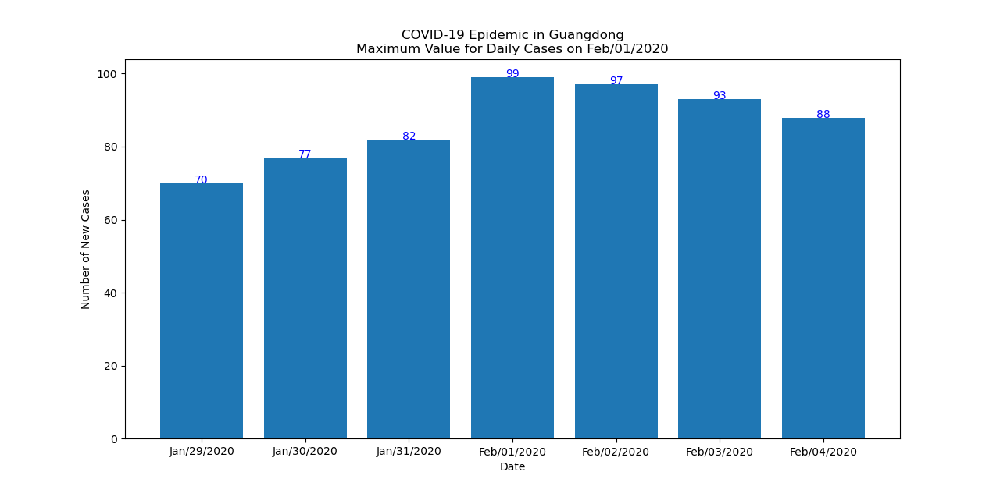
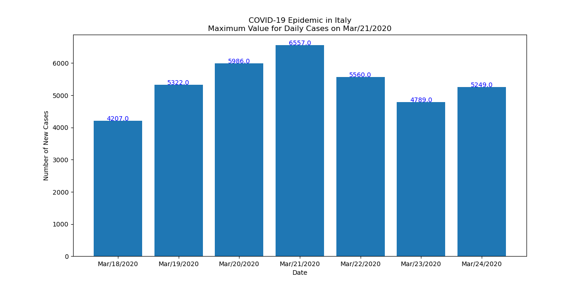
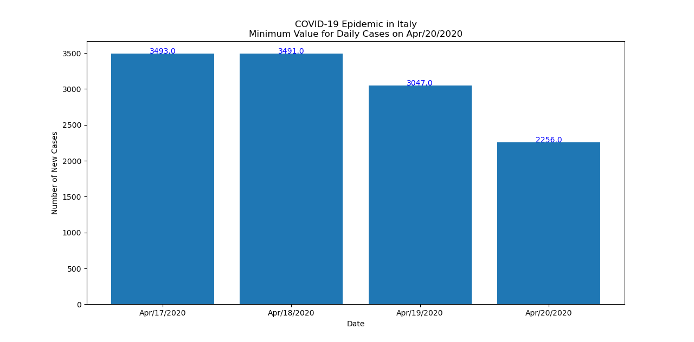
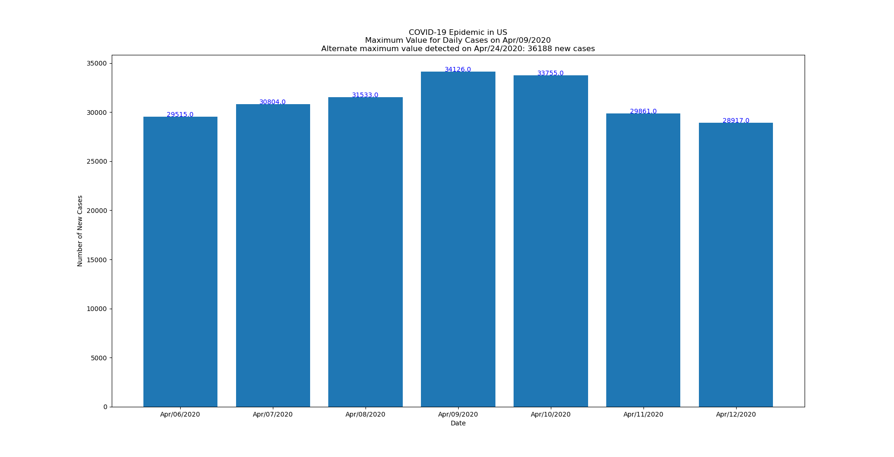

COVID-19 (Coronavirus) Tool to Show Highest and Lowest Daily COVID-19 Cases in a Country, Region, Province or State, or in the World
======================================================================================================================================

* This tool generates a bar plot of highest and lowest daily COVID-19 (SARS-CoV-2) cases, based on historical data from Johns Hopkins University. This tool is helpful for identifying the status of the study area in terms of the epidemic waves.  Typically, an epidemic works through a community in multiple waves.  The lowest value is useful for indentifying a trough between COVID-19 infection waves, and the highest value is useful to identify the peak of the first wave of COVID-19 in a study area.

* __EXAMPLE Command to obtain highest daily case value for province of Guangdong, China (Click to view Enlarged Image):__

  `python covid19_highest_lowest.py --province_state Guangdong --url https://raw.githubusercontent.com/CSSEGISandData/COVID-19/master/csse_covid_19_data/csse_covid_19_time_series/time_series_covid19_confirmed_global.csv --type highest`

* __ABBREVIATED Command used to obtain highest daily case value for province of Guangdong, China:__

  `python covid19_highest_lowest.py -p Guangdong -u https://raw.githubusercontent.com/CSSEGISandData/COVID-19/master/csse_covid_19_data/csse_covid_19_time_series/time_series_covid19_confirmed_global.csv -t highest`

* __Command to obtain HIGHEST daily case value for the entire world:__

  `python covid19_highest_lowest.py --world --url https://raw.githubusercontent.com/CSSEGISandData/COVID-19/master/csse_covid_19_data/csse_covid_19_time_series/time_series_covid19_confirmed_global.csv --type highest`

* __ABBREVIATED Command to obtain HIGHEST daily case value for the entire world:__

  `python covid19_highest_lowest.py -w --url https://raw.githubusercontent.com/CSSEGISandData/COVID-19/master/csse_covid_19_data/csse_covid_19_time_series/time_series_covid19_confirmed_global.csv --type highest`

* __Command to obtain highest daily case value for the country of Italy:__

  `python covid19_highest_lowest.py -c Italy -u https://raw.githubusercontent.com/CSSEGISandData/COVID-19/master/csse_covid_19_data/csse_covid_19_time_series/time_series_covid19_confirmed_global.csv -t highest`

* __Command to obtain LOWEST daily case value for country of Italy:__

  `python covid19_highest_lowest.py -c Italy -u https://raw.githubusercontent.com/CSSEGISandData/COVID-19/master/csse_covid_19_data/csse_covid_19_time_series/time_series_covid19_confirmed_global.csv -t lowest`

* __For help/instructions:__

  `python covid19_linear_plot.py -h`
  
* __Tips on Interpreting the Bar Plot Results:__

* The above plots for Italy showed the highest daily COVID-19 cases on March 21, 2020 and the curve resembles a Bell-curve so this looks to be the peak of the first wave of COVID-19 infections.  In the second Italy plot, the lowest daily cases was on April 20, 2020. If the lowest daily case number is located at the bottom of a V-shaped bar plot, this would indicate that there is a trough (bottom) between successive waves, so there may be an additional COVID-19 wave underway in the country. As of April 20 2020, this is NOT THE CASE in Italy as the lowest value is not located in a V-shaped bar plot so it's indicating a continual flattening of the curve.

* __Detecting Alternate High or Low Values:__

* This Python tool checks rolling values to detect the true high or low value in the wave of infection.  It can detect the alternate high or low of an infection wave, such as the alternate high infection value which occurred in the U.S. on April 24, 2020.  

* __Viewing the Plots on a Computer:__

* The plots are rendered by the Matplotlib plotting library. Be sure to click on the "Maximize" button at the top right corner of the plot window so that you see correct dimensions and font: 

* __Software Requirements:__ 

    Python 3 (on Windows, Mac, or Linux) and Python libraries numpy, matplotlib and Pandas.
